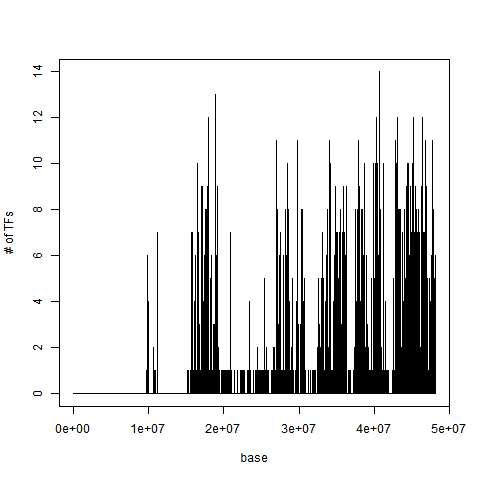
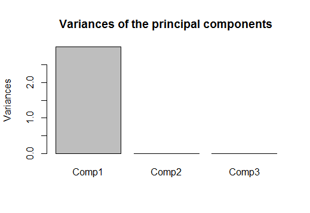
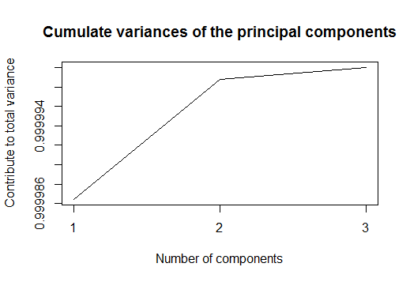
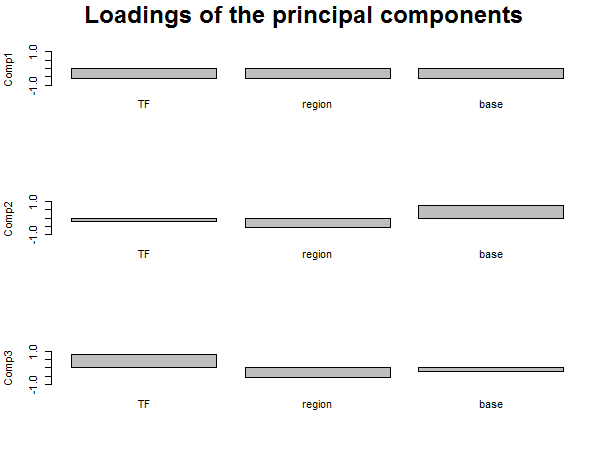
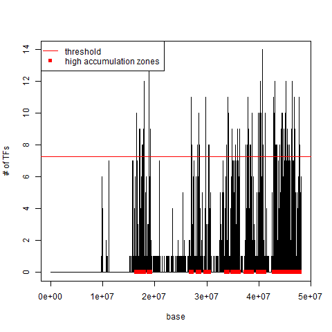

```{r setup, include=FALSE}
knitr::opts_chunk$set(echo = TRUE)
```

```{r, include=FALSE}
library(TFHAZ)
library(GenomicRanges)
library(IRanges)
library(S4Vectors)
data("data_man")
```

# Introduction

Transcription factors (TFs) are proteins that bind the DNA in specific regions 
and regulate gene expression. The regolation of the gene expression is often 
controlled by many TFs interacting with each other. Recent high throughput 
methods like chromatin immunoprecipitation followed by sequencing (ChIP-seq) 
[@park2009chip] provide a large number of data regarding TF binding regions, 
which are available in public repositories such as ENCODE [@encode2004encode] 
or Roadmap Epigenomics [@bernstein2010nih].   
Starting from a dataset containing the genomic positions of TF binding regions, 
the *TFHAZ* package allows finding trascription factor high accumulation DNA 
zones, i.e., regions along the genome where there is a high presence of 
different transcription factors. In addition, some functions are provided in 
order to analyze and compare results obtained with different input parameters.

# Dataset

Transcription factor dense DNA zones are found from a GRanges object that 
contains genomic regions of transcription factors at the ranges side and the 
name of the transcription factors at the metadata side. As in every object of 
GRanges class, the genomic coordinates are located on the left-hand side. The 
first column of the ranges side contains the chromosome of each region; the 
second column contains the genomic coordinates of each region (starting and 
ending position of the transcription factor binding region, considering a 
1-based inclusive coordinate system); the third column contains the strand of 
each region ("+", "-", or "\*" if unknown).   
The dataset we consider (called *Ishikawa*) is obtained from computation of 
ENCODE ChIP-Seq data of the localization of transcription factor binding regions
for the Ishikawa cell line. The data have been processed and extracted with GMQL
(GenoMetric Query Language http://www.bioinformatics.deib.polimi.it/GMQL/) 
[@masseroli2015genometric] [@ceri2016data] [@masseroli2016modeling]. 
The *Ishikawa* dataset contains 283,009 ranges of 16 different transcription 
factors.

```{r}
# load and visualize the dataset:
data("Ishikawa")
dim(as.data.frame(Ishikawa))
head(Ishikawa)

```

# Trascription factor accumulation
The first step in finding transcription factor dense DNA zones is to count the 
accumulation of TFs for each chromosome base. The function *accumulation* in the
*TFHAZ* package creates a vector in which, for each chromosome base, the 
accumulation of the TFs present in the input dataset is calculated. We 
considered three types of accumulation: TF accumulation, region accumulation 
and base accumulation.  

*TF accumulation*: for each base, it is the number of different TFs present in 
the neighborhood of the considered base. The neighborhood is defined by a window
with half-width w centered on the considered base.  

*Region accumulation*: for each base, it is the number of regions containing TFs
in the neighborhood of the considered base. If in the neighborhood of a base 
there are two input binding regions of the same TF, the accumulation value in 
that base is equal to 2 (differently from the TF accumulation, whose value in 
the same case is equal to 1).  

*Base accumulation*: for each base, it is the total number of bases belonging to
input regions containing TFs in the neighborhood of the considered base.  

With w=0, a single base approach is applied (no base neighborhood is 
considered). In this case, if in the input dataset overlapping regions for the 
same TF and chromosome do not exist, the results of *TF*, *region* and *base* 
accumulation are equal.  

The function *accumulation* takes in input:   

* a GRanges object containing coordinates of TF binding regions and their TF 
name;
* a string with the name of the accumulation type: "TF", "region", "base"; 
* a string with the name of the chromosome (e.g., "chr1"); 
* an integer, half-width of the window that defines the neighborhood of each 
base.     

The result of the *accumulation* function is a list containing: 

* accvector: a sparse vector containing the accumulation for each base of the 
selected chromosome;
* acctype: a string with the accumulation type used; 
* chr: a string with the chromosome name associated with the accumulation 
vector; 
* w: an integer with the half-width of the window used to calculate the 
accumulation vector.   

The accumulation vector obtained can be plotted using the function 
*plot_accumulation*.  
This function takes in input the output of the *accumulation* function and saves
the plot in a *.png* file.  


```{r}
# calculate TF accumulation for the chromosome 21 for w=0
TF_acc_21_w_0 <- accumulation(Ishikawa, "TF", "chr21", 0)
```

```{r, eval=FALSE}
# plot the accumulation vector
plot_accumulation(TF_acc_21_w_0)
```

```{r, echo=FALSE, fig.align='center', out.width='75%', fig.cap = "*Figure 1: Plot of the TF accumulation vector for the chromosome 21, obtained for w=0.*"}

```


As we can see in Figure 1, in this example considering no base neighborhood 
(w=0), the maximum value of accumulation found is 14. It means that in the bases
with that accumulation value there are overlapping binding regions of 14 out of the 16 transcription factors present in the dataset.

# Transcription factor dense DNA zones

Once the accumulation for each chromosome base is calculated, we can find 
transcription factor dense zones with the *dense_zones* function. For each 
accumulation threshold value defined, the function finds transcription factor 
dense DNA zones (regions). Starting from the accumulation vector calculated with
the *accumulation* function, each dense zone is formed by contiguous bases with 
accumulation equal or higher than the threshold. Threshold values are selected 
by setting the *threshold_step* parameter.    
For each accumulation threshold value, a ".bed" file with the chromosome and 
genomic coordinates of the dense zones found is created (Figure 2). The function
finds also the number of dense zones, the number of total bases belonging to the
dense zones, the minimum, maximum, mean, median and standard deviation of the 
dense zone lengths and of the distances between adjacent dense zones.   

The function *dense_zones* takes in input:  

- a list of four elements containing: a sparse vector with accumulation values
(e.g., obtained with the *accumulation* function), the accumulation type, 
a chromosome name, and the half-width of the window used for the accumulation 
count;
* an integer, the step used to calculate the threshold values. These values vary
from 1 to the maximum accumulation value in the considered accumulation
vector (e.g., found with the *accumulation* function).  

The result of the *dense_zones* function is a list containing:  

* zones_count: a data frame containing the considered threshold values and the 
number of
dense zones obtained with each threshold value;
* bases_count:  a data frame containing the considered threshold values and the 
total number of bases belonging to the dense zones obtained with each threshold 
value;
* lengths: a data frame containing the considered threshold values and min, max,
mean, median and standard deviation of the dense zone lengths obtained with each
threshold value;
* distances: data frame containing the considered threshold values and min, max,
mean, median and standard deviation of the distances between adjacent dense 
zones obtained with each threshold value;
* acctype: a string with the accumulation type used;
* chr: a string with the chromosome name associated with the accumulation vector
used;
* w: an integer with half-width of the window used to calculate the accumulation
vector.

```{r}
# find dense DNA zones, with threshold step equal to 1
TF_dense_21_w_0 <- dense_zones(TF_acc_21_w_0, 1)
TF_dense_21_w_0
```


```{r, echo=FALSE, fig.align='center', fig.small = TRUE, fig.cap = "*Figure2: Content of the 'bed' file with the coordinates of the seven dense DNA zones found with transcription factor accumulation threshold value equal to 12.*"}
knitr::include_graphics('./dense_zones_12.png')
```


We can plot the results present in the *zones_count* data frame with the 
function *plot_n_zones* (Figure 3) and we can see how the number of dense DNA 
zones decreases as the accumulation threshold value increases. The function also
plots the point of the graph with maximum slope change, corresponding to the 
maximum second derivative of the curve, circulating it with a red full line.

```{r, fig.align='center', fig.cap = "*Figure 3: Plot of the number of dense DNA zones found varying the TF accumulation threshold value; the point with maximum slope change is plotted circulated with a red full line.*"}
plot_n_zones(TF_dense_21_w_0)
```

\newpage
# Transcription factor dense DNA zones analysis

After finding transcription factor dense DNA zones, we can use two functions of 
the *TFHAZ* package to compare the results obtained with different values of *w*
half-width of the base neighborhood window and different accumulation types.  

With the function *w_analysis* we can plot the number of dense zones and the 
total number of bases belonging to these dense zones present in a set of inputs,
obtained (all with accumulation threshold=1) using the *dense_zones* function, 
for the same accumulation type, same chromosome, and different values of *w* 
half-width of the window defining the neighborhood of each base. The function 
takes in input a list of multiple outputs of the *dense_zones* function and 
returns a plot (with x axis logarithmic-scale).  

```{r, fig.align='center', fig.cap="*Figure 4: Plot of the number of dense DNA zones (red full line) and of the total number of bases belonging to dense DNA zones (blue dashed line) obtained with different values of neighborhood window half-width w.*"}
# l is a list with four objects obtained with the dense_zones function with 
# w = 10, 100, 1000, 10000.
l <- list(TF_dense_21_w_10, TF_dense_21_w_100, TF_dense_21_w_1000, TF_dense_21_w_10000)
# plot
w_analysis(l)
```  


If we consider the four different values of *w* half-width of the base 
neighborhood window in the example, we can notice in Figure 4 that the two 
measures (i.e., the number of dense zones and the total number of bases 
belonging to these dense zones) are inversely correlated; the number of bases 
increases with the size of the neighborhood, while the number of dense zones 
decreases. Furthermore, observing the plot, we can notice that the highest 
increase or decrease of the two measures occurs when the half-width of the 
neighborhood assumes values higher than 1000 bases. So, w=1000 can be considered
a good value in finding dense zones when using an accumulation approach with 
neighborhood (w different from 0). It is worth noting that the calculation time 
of the accumulation vector increases considerably with higher values of w.


In order to understand how to integrate the results obtained with the three 
different accumulation types, using the function *n_zones_PCA* we can perform 
the Principal Component Analysis (PCA) [@johnson2014applied] [@bro2014principal]
of the number of dense zones obtained by varying the threshold on accumulation 
values obtained with the three methods of accumulation (TF, region, base).  

The Principal Component Analysis produces a low dimensional representation of a 
dataset, finding a linear sequence of linear combinations of the variables that 
have maximal variance. 
With PCA we want to find if there is a possible way to combine the three 
measures (TF, region, base accumulation), or if the information obtained is the
same, and we can use only one of these measures for our study. For this purpose
it is useful to observe the variance associated with the first principal 
component and the loadings, the coefficients of the linear combination of each
principal component, that explain the proportion of each variable along each
principal component. 

This function takes in input:  

- a list with the results of the *dense_zones* function using the TF 
accumulation method and varying the thresholds on the considered accumulation
values;
- a list with the results of the *dense_zones* function using the region
accumulation method and varying the thresholds on the considered accumulation
values;
- a list with the results of the *dense_zones* function using the base
accumulation method and varying the thresholds on the considered accumulation
values.  

The outputs of the function are:  

* a list with a summary containing the standard deviation on each principal
component, the proportion of variance explained by each principal component, the
cumulative proportion of variance described by each principal component, and the
loadings of each principal component;
* a plot with the variances of the principal components;
* a plot with the cumulate variances of the principal components;
* a plot with the loadings of the three principal components.


Note that the function *n_zones_PCA* works only if the number of different
threshold
values used to find the dense zones with the *dense_zones* function is the same
for all the three accumulation types, while the threshold values can be
different. 


```{r PCA, fig.keep="none"}
# TF_dense_21_w_10 is the output of dense_zones function applied to the
# accumulation vector found with w=10, chr="chr21", acctype="TF".
# reg_dense_21_w_10 is the output of dense_zones function applied to the
# accumulation vector found with w=10, chr="chr21", acctype="reg".   
# base_dense_21_w_10 is the output of dense_zones function (with 
# threshold_step=21 in order to have 14 threshold values as in the other two
# inputs) applied to the accumulation vector found with w=10, chr="chr21",
# acctype="base".
# PCA
n_zones_PCA(TF_dense_21_w_10, reg_dense_21_w_10, base_dense_21_w_10)
```

```{r echo=FALSE, fig.align='center', out.width = '75%',fig.cap = "*Figure 5: Plot of the variances of the principal components.*"}

``` 

```{r echo=FALSE, fig.align='center', out.width='75%', fig.cap = "*Figure 6: Plot of the cumulate variances of the principal components.*"}

``` 
```{r echo=FALSE, fig.align='center', out.width='100%', fig.cap = "*Figure 7: Plot of the loadings of the three principle components.*"}

``` 


From this example we can see how the first principal component explains most of the variation (Figure 5 and Figure 6), so it accounts for maximum information. Furthermore, we can see how the values of loadings of the first principal component are very similar (Figure 7). Therefore, we can say that the information obtained with the three methods of accumulation is the same and for our study regarding transcription factor dense DNA zones we can use only one method of the three; we suggest using the *TF* or *region accumulation* because the running time of the *accumulation* function with *acctype*=*base* is higher, especially in chromosomes with an elevated number of input regions. 

# Trancription factor high accumulation DNA zones

In the previous part we found transcription factor dense DNA zones with
different thresholds of transcription factor accumulation, and we compared the
results using different input parameters in order to identify the best way to
find regions of the genome where there is a high presence of different
trascription factors. Now, with the function *high_accumulation_zones*, setting
only one threshold value, we can find these regions; we call them transcription
factor high accumulation DNA zones (TFHAZ). Starting from the accumulation
vector calculated with the \emph{accumulation} function, each TFHAZ is formed by
contiguous bases with accumulation higher than the threshold (TH). The threshold
is found, considering all the accumulation values of the vector higher than
zero, with the following formula: \emph{TH = mean(accvector) + 2*std(accvector)}
, where \emph{mean} and \emph{std} are respectively the mean and standard
deviation of the accumulation values higher than zero in the \emph{accvector}.   
The function finds also the number of high accumulation zones, the number of
total bases belonging to these zones, the minimum, maximum, mean, median and
standard deviation of the zone lengths and of the distances between adjacent
zones. Furhermore, the function plots, for each chromosome base (x axis), the
value of accumulation (y axis) calculated with the \emph{accumulation} function.
On this graph there are also shown the threshold (with a red horizontal line)
and, on the x axis, the bases belonging to the high accumulation zones (with red
boxes). The plot is saved in a ".png" file.  
The function *high_accumulation_zones* takes in input:  

* a list of four elements containing: a sparse vector with accumulation values
(e.g., obtained with the \emph{accumulation} function), the accumulation type, a
chromosome name, and the half-width of the window used for the accumulation
count.  

The result of the *high_accumulation_zones* function is a list containing:  

* n_zones: an integer containing the number of high accumulation zones obtained;
* n_bases: an integer containing the total number of bases belonging to the high
accumulation zones obtained;
* lengths: a vector containing the considered threshold value and min, max,
mean, median and standard deviation of the high accumulation zone lengths
obtained;
* distances: a vector containing the considered threshold value and  min, max,
mean, median and standard deviation of the distances between adjacent high
accumulation zones obtained;
* TH: a number with the threshold value found;
* acctype: a string with the accumulation type used;
* chr: a string with the chromosome name associated with the accumulation vector
used;
* w: an integer with half-width of the window used to calculate the accumulation
vector.

Furthermore, a ".bed" file with the chromosome and genomic coordinates of the
high accumulation zones found is created.

```{r}
# find high accumulation DNA zones
TFHAZ_21_w_0 <- high_accumulation_zones(TF_acc_21_w_0)
TFHAZ_21_w_0
```

From the results of this example we can see that with a threshold equal to 7.3
we find 93 high accumulation zones. We can see the distribution of these zones
along the chromosome (in this case the chromosome 21) in Figure 8, while in
Figure 9 it is shown a part (31 out of 93 zones) of the ".bed" file with the
coordinates of the zones.

```{r echo=FALSE, fig.align="center", out.width='75%',fig.cap = "*Figure 8: Plot of the TF accumulation vector (for the chromosome 21, obtained for w=0) and of the high accumulation DNA zones (red boxes on the x axis) found; the threshold used to find these zones (7,268413) is shown with a red horizontal line.*"}

```

```{r echo=FALSE, fig.align='center', fig.small = TRUE, fig.cap = "*Figure 9: Content of the 'bed' file with the coordinates of 31 out of the 93 high accumulation DNA zones found.*"}
knitr::include_graphics('./HAZ_bed.png')
```


# Acknowledgement

We really appreciate the generous support and suggestions by Stefano Campaner
and Stefano Perna. 

# References
